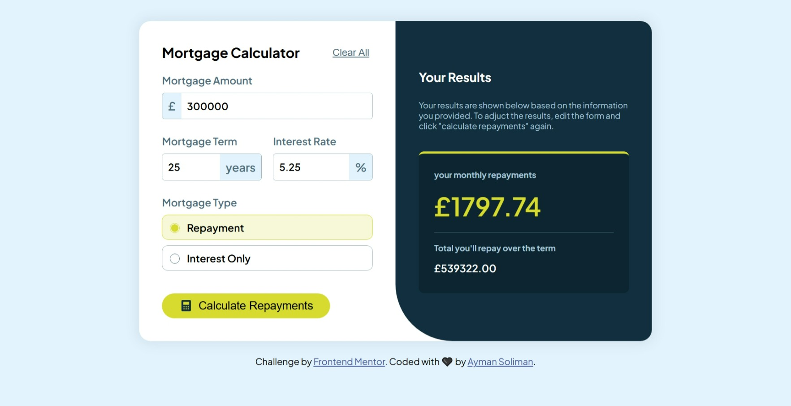

# Frontend Mentor - Mortgage repayment calculator solution

This is a solution to the [Mortgage repayment calculator challenge on Frontend Mentor](https://www.frontendmentor.io/challenges/mortgage-repayment-calculator-Galx1LXK73). Frontend Mentor challenges help you improve your coding skills by building realistic projects. 

## Table of contents

- [Overview](#overview)
  - [The challenge](#the-challenge)
  - [Screenshot](#screenshot)
  - [Links](#links)
- [My process](#my-process)
  - [Built with](#built-with)
  - [What I learned](#what-i-learned)
  - [Continued development](#continued-development)
  - [Useful resources](#useful-resources)
- [Author](#author)
- [Acknowledgments](#acknowledgments)

**Note: Delete this note and update the table of contents based on what sections you keep.**

## Overview

### The challenge

Users should be able to:

- Input mortgage information and see monthly repayment and total repayment amounts after submitting the form
- See form validation messages if any field is incomplete
- Complete the form only using their keyboard
- View the optimal layout for the interface depending on their device's screen size
- See hover and focus states for all interactive elements on the page

### Screenshot



## 


### Links

- Solution URL: [Challenge Solution](https://www.frontendmentor.io/solutions/css-custom-properties-flexbox-js-including-dom-manipulation-I-jUV5DIzr)
- Live Site URL: [Add live site URL here](https://your-live-site-url.com)

## My process

### Built with

- Semantic HTML5 markup
- CSS custom properties
- Flexbox
- Desktop-first workflow
- Responsive Design
- JavaScript (including DOM manipulation)
- Custom validation & error handling

### What I learned

I learned to customize ```<input>``` elements, and how to customize their design according to the state of validation. I also learned how to apply clean code to functions.

```html
<input type="radio" .../>
<label for="...">Repayment</label>
```
```css
input[type="radio"] {
  display: none;
}

input[type="radio"] + label::before {
  content: "";
  width: 0.65rem;
  height: 0.65rem;
  outline: 1px solid hsl(200, 24%, 40%);
  border-radius: 50%;
  display: inline-block;
  margin: 0 0.5rem 0 0.25rem;
  outline-offset: 2px;
}

.mortgage__type:hover {
  border-color: hsl(61, 70%, 52%) !important;
}

input[type="radio"]:checked + label::before {
  outline-color: hsl(61, 70%, 52%);
  background-color: hsl(61, 70%, 52%);
}

.mortgage__type:has(input[type="radio"]:checked) {
  border-color: hsl(61, 70%, 52%) !important;
  background-color: hsla(61, 70%, 52%, 0.193);
}
```
```js
calculateRepaymentsBtn.addEventListener("click", function (event) {
  event.preventDefault();
  trimValues();
  isValid = validateForm();

  if (isValid) {
    calculateRepayments();
    generateRepaymentsResults();
  } else {
    clearPreviousErrors();
    showErrorStates();
    generateResultsLandPage();
  }
});

function validateForm() {
  return Array.from(inputFields).every((field) => checkValidity(field));
}

function checkValidity(field) {
  let inputElement = field.querySelector('input[type="text"]');
  let radioElements = field.querySelectorAll('input[type="radio"]');

  return (
    (inputElement ? inputElement.value !== "" : false) ||
    Array.from(radioElements).some((radio) => radio.checked)
  );
}
// 
function showErrorStates() {
  inputFields.forEach((field) => {
    if (!checkValidity(field)) {
      field.classList.add("error");
      addErrorMsg(field);
    }
  });
}

function addErrorMsg(field) {
  let error = document.createElement("span");
  error.classList.add("error-message");
  error.textContent = "This field is required";
  field.after(error);
}
```

### Continued development

I must continue focusing on advanced JavaScript concepts to handle upcoming responsive design demands.

### Useful resources

- [Slaying The Dragon YouTube Channel](https://www.youtube.com/@slayingthedragon) - This helped me with mastering Flexbox. I really appreciate his simple way of teaching such important concepts.

## Author

- Website - [Ayman Soliman](https://bento.me/ayman-soliman)
- Frontend Mentor - [@ayman-soliman-1783](https://www.frontendmentor.io/profile/ayman-soliman-1783)
- Twitter - [@a_soliman1783](https://x.com/a_soliman1783)